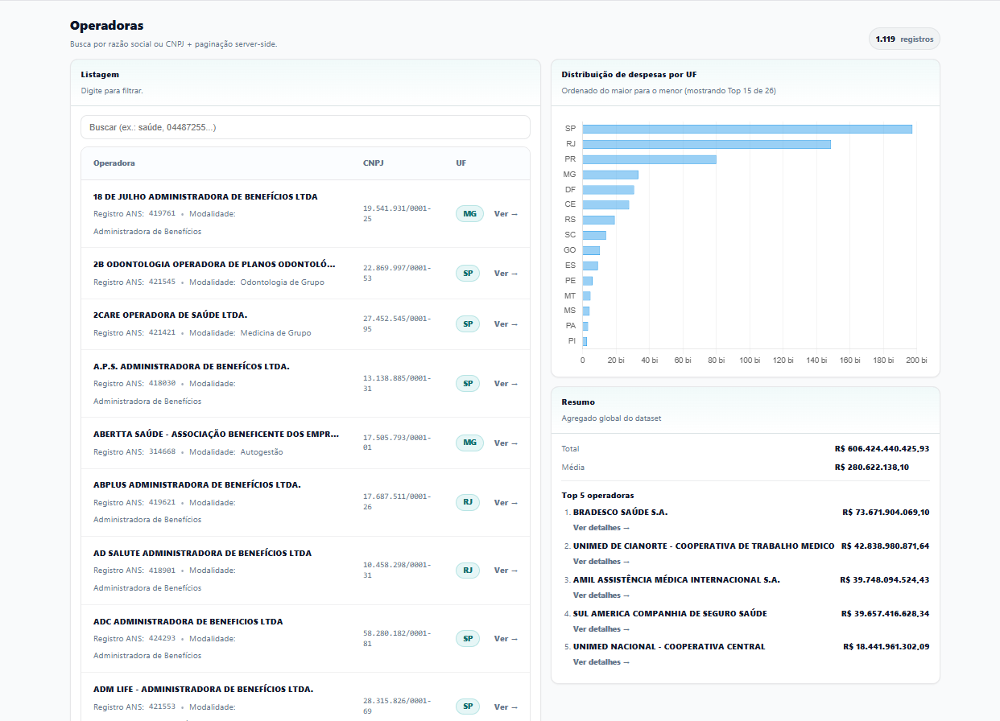

# Teste Técnico — Intuitive Care

## Nota de Organização do Documento

Este README foi organizado de forma **progressiva e incremental**, acompanhando a evolução do projeto ao longo dos testes.
Os Testes 1 e 2 utilizam **checklists operacionais**, pois representam pipelines executáveis.
Os Testes 3 e 4 utilizam **descrições estruturais**, pois tratam de persistência, análise e exposição de dados.

---

# Teste Técnico — Intuitive Care

Este repositório contém a implementação do teste técnico proposto para alinhamento da vaga de estágio na empresa **Intuitive Care**.

Testes contemplados:

1. **Integração com API Pública (ANS)**
2. **Transformação, Enriquecimento e Validação de Dados**
3. **Banco de Dados e Análise (SQL)**
4. **API + Interface Web (Frontend)**

---

## Estrutura do Projeto

```text
.
├── backend/
│   ├── scripts/                 # Entrypoints (run_test1.py, run_test2.py, ...)
│   ├── src/app/
│   │   ├── api/                 # API (Teste 4)
│   │   ├── services/            # Camada de serviço (Teste 4)
│   │   ├── repositories/        # Camada de acesso ao banco (Teste 4)
│   │   ├── core/                # Config/Paths/Tipos compartilhados
│   │   ├── domain/              # Modelos e validações
│   │   └── usecases/            # Etapas do pipeline (Testes 1 e 2)
│   └── tests/                   # Testes (exploratórios/integration)
├── frontend/                    # Interface web em Vue.js (Teste 4)
├── db/                          # Scripts SQL e consultas (Teste 3)
├── data/
│   ├── raw/                     # Zips baixados da ANS + CADOP local
│   ├── extracted/               # Conteúdo extraído dos zips
│   ├── staging/                 # Arquivo intermediário normalizado
│   └── output/
│       ├── teste1/              # Saídas do Teste 1
│       └── teste2/              # Saídas do Teste 2
├── docs/                        # Decisões técnicas e documentação
├── delivery/                    # Artefatos finais de entrega (ZIP)
└── README.md
```

---

## Arquitetura (visão rápida)

O projeto segue um **pipeline orientado a artefatos**:

- cada etapa lê o(s) arquivo(s) do estágio anterior
- processa em streaming sempre que possível
- gera um novo artefato em `data/output/...` (ou `data/staging/...`)
- o diretório `delivery/` é reservado para **artefatos finais** (gerados pelo runner)

**Camadas:**

- `domain/`: regras puras (ex.: validação de CNPJ, parsing numérico)
- `usecases/`: orquestração das etapas do pipeline (Testes 1 e 2)
- `scripts/`: entrypoints que executam o pipeline completo por teste
- `api/`: camada de API (Teste 4)
- `db/`: scripts SQL (Teste 3)

---

## Configuração do Ambiente de Desenvolvimento

Da raiz do projeto:

```bash
python -m venv venv
```

Ative o ambiente virtual:

**Linux/Mac**
```bash
source venv/bin/activate
```

**Windows**
```bash
venv\Scripts\activate
```

Instale dependências:

```bash
pip install -r requirements.txt
```

---

## Como Rodar os Testes

Os entrypoints ficam em `backend/scripts`.

> Dica: a flag `--clean` remove os arquivos gerados anteriormente para executar um teste limpo, evitando duplicação de dados.

Exemplos:

```bash
python backend/scripts/run_test1.py --clean
python backend/scripts/run_test2.py --clean --nome Gabriel_Martins
```

---

#### Como rodar a API (PostgreSQL)

1) Suba o banco e rode o Teste 3 (ou rode os scripts SQL):

```bash
psql -U postgres -d <seu_banco> -f db/001_ddl.sql
psql -U postgres -d <seu_banco> -f db/002_import.sql
```

2) Configure a variável de ambiente:

- Crie um arquivo `.env` na raiz do projeto com as seguintes variáveis:
```bash
DATABASE_URL="postgresql+psycopg://<seu_usuario>:<sua_senha>@localhost:5432/<seu_banco>"
```

- Ou configure a variável de ambiente diretamente no terminal:

```bash
# Linux/Mac
export DATABASE_URL="postgresql+psycopg://<seu_usuario>:<sua_senha>@localhost:5432/<seu_banco>"

# Windows CMD
set DATABASE_URL="postgresql+psycopg://<seu_usuario>:<sua_senha>@localhost:5432/<seu_banco>"

# Windows PowerShell
$env:DATABASE_URL="postgresql+psycopg://<seu_usuario>:<sua_senha>@localhost:5432/<seu_banco>"
```

3) Rode o servidor:

- Use o runner em `backend/scripts/run_api.py`

```bash 
python backend/scripts/run_api.py
```

- Ou rode diretamente no terminal (a flag --app-dir é obrigatória): 

```bash
uvicorn app.api.main:app --reload --port 8000 --app-dir backend/src
```

> A documentação interativa fica em:
> - Swagger: `/docs`
> - ReDoc: `/redoc`


---


## Progresso dos Testes

A especificação de cada trade-off e decisão técnica está em `docs/decisoes_tecnicas.md`.

Os dados brutos e intermediários ficam em `data/` (`raw`, `extracted`, `staging`, `output/...`) para facilitar auditoria.

---

### Teste 1 — Integração com API (ANS)

- [x] **1.1 — Download** dos arquivos de Demonstrações Contábeis (últimos 3 trimestres)  
  Código: `backend/src/app/usecases/ans_download.py`

- [x] **1.2 — Extração + Normalização** (filtro: Despesas com Eventos/Sinistros)  
  Código: `backend/src/app/usecases/ans_normalization.py`

- [x] **1.3 — Consolidação** (CSV final + ZIP)  
  Código: `backend/src/app/usecases/ans_consolidate.py`

**Rodar**
- Arquivo: `backend/scripts/run_test1.py`
- Exemplo:
  - `python backend/scripts/run_test1.py`
  - `python backend/scripts/run_test1.py --clean`

**Saídas**
- `data/output/teste1/consolidado_despesas.csv`
- `data/output/teste1/consolidado_despesas.zip`

---

### Teste 2 — Transformação, Enriquecimento e Validação

A sequência começou pelo **2.2**, pois o consolidado do Teste 1 utiliza `RegistroANS` (a fonte não possui CNPJ).  
Detalhes em `docs/decisoes_tecnicas.md`.

- [x] **2.2 — Enriquecimento (Join com CADOP)**  
  Código: `backend/src/app/usecases/ans_enrich_validate.py`

- [x] **2.1 — Validação**  
  Código: `backend/src/app/usecases/ans_enrich_validate.py`

- [x] **2.3 — Agregação (RazaoSocial + UF)**  
  Código: `backend/src/app/usecases/ans_agregate.py`

**Trade-offs principais**
- CADOP carregado em memória como dicionário (pequeno, acesso O(1)).
- Consolidado processado em streaming (RAM previsível).
- Registros inválidos **não são descartados**: são marcados com flags (`cnpj_valido`, `valor_positivo`, etc.) + campo `erros`.
- Na agregação, a ordenação acontece **após reduzir** o dataset (ordenamos apenas os grupos agregados).

**Rodar**
- Arquivo: `backend/scripts/run_test2.py`
- Exemplo:
  - `python backend/scripts/run_test2.py`
  - `python backend/scripts/run_test2.py --clean --nome Gabriel_Martins`


**Saídas**
- `data/output/teste2/consolidado_despesas_final.csv`
- `data/output/teste2/consolidado_despesas_final.zip`
- `data/output/teste2/despesas_agregadas.csv`
- `data/output/teste2/Teste_<nome>.zip` *(zip técnico do teste2, usado como fonte para entrega)*
- `delivery/Teste_Agregacao_<nome>.zip` *(artefato final de entrega)*

---

### Teste 3 — Banco de Dados e Análise (PostgreSQL)

Este teste utiliza os CSVs gerados no Teste 2 para persistência em banco relacional
(PostgreSQL > 10) e execução de consultas analíticas.

**Fontes**
- `data/output/teste2/consolidado_despesas_final.csv`
- `data/output/teste2/despesas_agregadas.csv`
- `data/raw/Relatorio_cadop.csv` (CADOP)

**Modelo**
- Abordagem normalizada:
  - Dimensão: dados cadastrais da operadora (CADOP)
  - Fato: despesas trimestrais por operadora
- Tabela adicional com a agregação do Teste 2.3 para validação e análise rápida.

**Scripts**
- `db/001_ddl.sql` — schema, tabelas e índices
- `db/002_import.sql` — staging, carga dos CSVs, saneamento e rejeições
- `db/003_queries.sql` — consultas analíticas solicitadas no enunciado

**Execução (psql)**
```bash
psql -U postgres -d <seu_banco> -f db/001_ddl.sql
psql -U postgres -d <seu_banco> -f db/002_import.sql
psql -U postgres -d <seu_banco> -f db/003_queries.sql
```

> As decisões técnicas e trade-offs do Teste 3 estão documentados em
docs/decisoes_tecnicas.md.
---

### Teste 4 — API + Interface Web (FastAPI + Vue.js)

Este teste entrega duas partes:

1) **API em Python** (FastAPI) expondo operadoras, despesas e estatísticas  
2) **Frontend em Vue.js** consumindo a API (tabela paginada, busca/filtro, gráfico por UF e detalhes)

Os arquivos relacionados à API estão em:

- `backend/src/app/api`: Inicio da API, conexão com o banco de dados, schemas e rotas
- `backend/src/app/repositories`: Repositórios de dados, camada intermediária de acesso ao banco de dados
- `backend/src/app/services`: Serviços de negócio, camada de acesso às operações de negócios

> As decisões técnicas e trade-offs do Teste 4 estão documentadas em `docs/decisoes_tecnicas.md`.

#### 4.1 — Fonte de Dados

A API utiliza **PostgreSQL** (o banco criado no Teste 3) como fonte única de dados.

#### 4.2 — Rotas da API

Base URL: `http://localhost:8000`

- `GET /api/operadoras?page=<int>&limit=<int>&q=<str?>`  
  Lista operadoras com paginação e filtro opcional por **razão social** ou **CNPJ**.

- `GET /api/operadoras/{cnpj}`  
  Retorna detalhes cadastrais de uma operadora (por CNPJ).

- `GET /api/operadoras/{cnpj}/despesas`  
  Histórico de despesas da operadora (por trimestre/ano).

- `GET /api/estatisticas`  
  Estatísticas agregadas:
  - total de despesas
  - média
  - top 5 operadoras por total
  - distribuição de despesas por UF (para o gráfico do frontend)

#### Como rodar a API (PostgreSQL)

1) Suba o banco e rode o Teste 3 (ou rode os scripts SQL):

```bash
psql -U postgres -d <seu_banco> -f db/001_ddl.sql
psql -U postgres -d <seu_banco> -f db/002_import.sql
```

2) Configure a variável de ambiente:

- Crie um arquivo `.env` na raiz do projeto com as seguintes variáveis:
```bash
DATABASE_URL="postgresql+psycopg://<seu_usuario>:<sua_senha>@localhost:5432/<seu_banco>"
```

- Ou configure a variável de ambiente diretamente no terminal:

```bash
# Linux/Mac
export DATABASE_URL="postgresql+psycopg://<seu_usuario>:<sua_senha>@localhost:5432/<seu_banco>"

# Windows CMD
set DATABASE_URL="postgresql+psycopg://<seu_usuario>:<sua_senha>@localhost:5432/<seu_banco>"

# Windows PowerShell
$env:DATABASE_URL="postgresql+psycopg://<seu_usuario>:<sua_senha>@localhost:5432/<seu_banco>"
```

3) Rode o servidor:

- Use o runner em `backend/scripts/run_api.py`

```bash 
python backend/scripts/run_api.py
```

- Ou rode diretamente no terminal (a flag --app-dir é obrigatória): 

```bash
uvicorn app.api.main:app --reload --port 8000 --app-dir backend/src
```

> A documentação interativa fica em:
> - Swagger: `/docs`
> - ReDoc: `/redoc`

#### Como rodar o Frontend (Vue 3 + Vite)

1) Abra um novo terminal e entre na pasta do frontend:

```bash
cd frontend
```

2) Instale as dependências:

```bash
npm install
```

3) Configure a URL da api:

- O axios usa baseUrl relativa:

```ts
export const api = axios.create({
  baseURL: "",
  timeout: 15000,
});
```

- Então o proxy do vite configura a baseUrl absoluta:
``` ts
export default defineConfig({
  plugins: [vue()],
  server: {
    proxy: {
      "/api": "http://127.0.0.1:8000",  // altere aqui se necessário
    },
  },
});
```

- Por padrão a api ja inicia na porta 8000 e o frontend na 5173.

- Suba o frontend:

```bash
npm run dev
```

#### Funcionalidades da Interface Web

A interface web implementada permite:

- Listagem paginada de operadoras
- Busca por CNPJ ou Razão Social
- Visualização de detalhes cadastrais da operadora
- Histórico de despesas por trimestre
- Visualização gráfica da distribuição de despesas por UF

- Acesse: `http://localhost:5173`

#### Postman

A coleção do Postman fica em `docs/postman/healthtech.postman_collection.json`.

Ela inclui exemplos de:
- listagem paginada
- busca por `q`
- detalhes por CNPJ
- histórico de despesas
- estatísticas agregadas

---

#### Visualização Final Frontend + Dados




